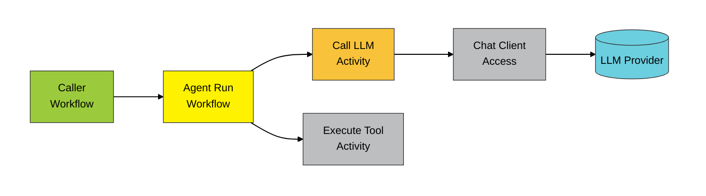

```mermaid
%%{init: {"theme": "base", "themeVariables": {"background": "#ffffff", "lineColor": "#000000", "textColor": "#000000", "primaryTextColor": "#000000", "edgeLabelBackground": "#ffffff"}}}%%
%% Model reasoning in an agent run
flowchart TD
    subgraph canvas [" "]
        CallerWorkflow["Caller<br/>Workflow"]:::client
        AgentRunWorkflow["Agent Run<br/>Workflow"]:::manager
        CallLLMActivity["Call LLM<br/>Activity"]:::engine
        ChatClientAccess["Chat Client<br/>Access"]:::access
        ExecuteToolActivity["Execute Tool<br/>Activity"]:::access
        LLMProvider[("LLM Provider")]:::resource
        CallerWorkflow --> AgentRunWorkflow
        AgentRunWorkflow --> CallLLMActivity
        AgentRunWorkflow --> ExecuteToolActivity
        CallLLMActivity --> ChatClientAccess
        ChatClientAccess --> LLMProvider
    end
    classDef client fill:#9BCB3C,stroke:#333,color:#000
    classDef manager fill:#FFF200,stroke:#333,color:#000
    classDef engine fill:#F8C33A,stroke:#333,color:#000
    classDef access fill:#BCBEC0,stroke:#333,color:#000
    classDef resource fill:#6CCFE0,stroke:#333,color:#000
    classDef utility fill:#D69CC6,stroke:#333,color:#000
    linkStyle default stroke:#000,stroke-width:1.5px
    style canvas fill:#ffffff,stroke:#ffffff
```
